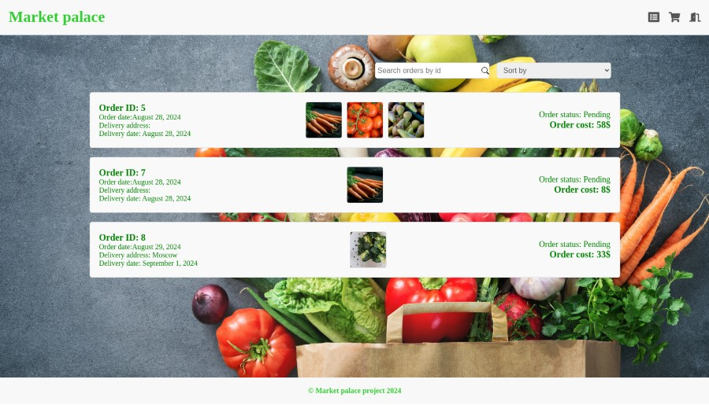

# Market Palace

Market Palace is an online marketplace application designed for customers to browse products, manage
their orders, and utilize a shopping cart. The application features both authenticated and
unauthenticated user access, with different functionalities available based on user status.

## Features

### Common Pages

- **Main Page**: Displays a list of all products available in the marketplace. Users can search for
  products and sort them by name or price. Unauthenticated users can view this page and product
  details, but will be redirected to the login page if they try to add items to the cart.
  

- **Product Page**: Shows detailed information about a specific product. This page is accessible to
  both authenticated and unauthenticated users.
  

### Authenticated User Pages

- **My Orders Page**: Available to authenticated users only. Displays a list of orders made by the
  user, with options to sort them by price or date.
  

- **Cart Page**: Available to authenticated users only. Displays items currently in the user's
  shopping cart.
  

### Authentication Pages

- **Login Page**: For user authentication. Users must log in to access certain features.
  

- **Registration Page**: For new users to create an account.
  

## User Permissions

- **Unauthenticated Users**: Can view the Main Page and Product Page. Attempting to add items to the
  cart will redirect them to the Login Page.
- **Authenticated Users**: Can access the Main Page, Product Page, My Orders Page, and Cart Page.
  They can also manage their cart and place orders. If they log out and log back in, their cart data
  will be preserved.

## Backend Endpoints

- **POST /login**: Authenticate a user.
- **POST /signup**: Register a new user.
- **GET /products**: Retrieve a list of all products.
- **GET /products/{id}**: Retrieve details of a specific product.
- **GET /my-orders**: Retrieve the list of orders made by the authenticated user.
- **POST /my-orders**: Create a new order.
- **GET /cart**: Retrieve the current user's shopping cart.
- **POST /cart**: Add items to the cart.
- **PUT /cart**: Update items in the cart.

## Technology Stack

- **Frontend**: JS(React, Redux, Styled-components).
- **Backend**: Kotlin (Ktor, exposed, sqlite).

## Setup Instructions

### Backend

1. Navigate to the backend directory.
2. Build the project and install dependencies: `./gradlew build`.
3. Start the backend server: `./gradlew run`.

### Frontend

1. Open a new terminal and navigate to the React application directory.
2. Install dependencies: `yarn install`.
3. Start the frontend application: `yarn start`.

## Repository Structure

- **backend/**: Contains backend server code.
- **frontend/**: Contains React application code.

Market Palace provides a user-friendly platform for customers to manage their shopping experience
efficiently.

